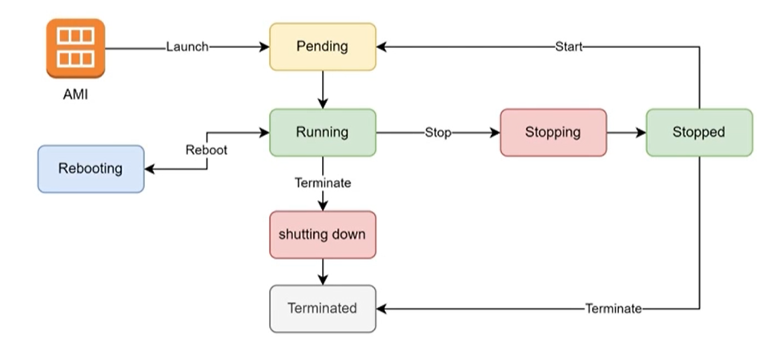
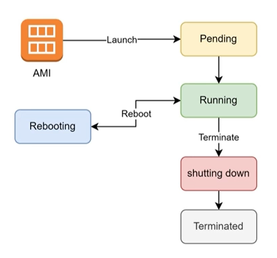

Life cycle of EC2 by default

Các thao tác cơ bản đối với EC2
Launch Instance 
Reboot instance 
Stop instance 
Start Instance 
Terminate instance 
Attach/Detach Volume 
Attach/Detach IP 
Attach/Detach Security Group 
Attach/Detach IAM Role 
Create Snapshot from Volume 
Create AMI from EC2 Instance

Life cycle of EC2 using instance-store volume

EC2 hỗ trợ 1 loại ổ cứng "instance-store". Loại ổ cứng này gắn trực tiếp lên máy host, có đặc điểm là sẽ mất dữ liệu khi instance stop, tuy nhiên IOPS rất cao. Phù hợp cho lưu trữ những data không quan trọng hoặc data caching nhưng đòi hỏi tốc độ đọc ghi cao. 
Lưu ý #1: loại instance này chỉ hỗ trợ một số AMI và Instance type nhất định. 
Lưu ý #2: instance sử dụng root volume với loại này sẽ không thể stop tạm thời (chỉ có thể launch, reboot, terminate).

